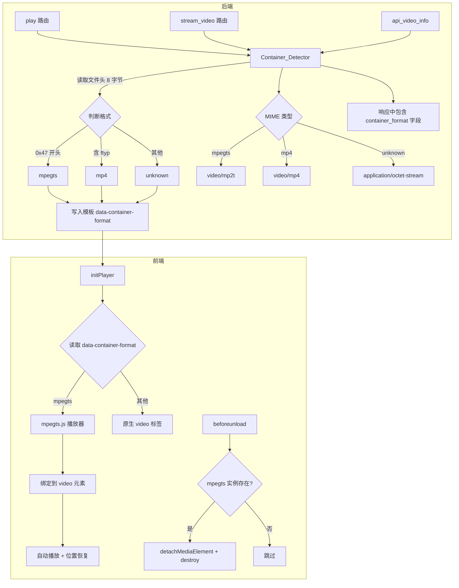

# 设计文档：MPEG-TS 容器格式播放支持

## 概述

本设计为现有的局域网视频服务器增加 MPEG-TS 容器格式的播放能力。核心思路是：后端通过读取文件头字节检测实际容器格式，前端根据检测结果决定使用原生 `<video>` 标签还是 mpegts.js 库进行播放。

当前系统使用 `mimetypes.guess_type()` 基于文件扩展名推断 MIME 类型，无法识别扩展名为 `.mp4` 但实际为 TS 容器的文件。本方案在不破坏现有 MP4 播放流程的前提下，透明地支持 TS 格式。

### 设计决策

1. **容器检测放在后端**：文件头读取在服务端完成，避免前端额外请求或试错。检测结果通过 API 和模板属性传递给前端。
2. **CDN 引入 mpegts.js**：不打包到项目中，通过 CDN 加载，减少仓库体积。加载失败时回退到原生播放。
3. **最小侵入式改造**：现有 MP4 播放路径完全不变，仅在检测到 TS 格式时走 mpegts.js 分支。

## 架构



## 组件与接口

### 1. Container_Detector（后端模块）

新增函数 `detect_container_format(file_path: str) -> str`，位于 `video_catalog.py`。

```python
def detect_container_format(file_path: str) -> str:
    """
    读取文件头 8 字节，判断容器格式。
    返回 'mpegts' | 'mp4' | 'unknown'
    """
```

**逻辑**：
- 读取前 8 字节
- 第一个字节为 `0x47` → `mpegts`（TS sync byte）
- 前 8 字节中包含 `b'ftyp'` → `mp4`（ISO BMFF magic）
- 其他情况或读取失败 → `unknown`

该函数为纯函数（给定文件路径，返回字符串），便于测试和复用。

### 2. Video_Info_API 扩展

修改 `app.py` 中的 `api_video_info` 端点，在返回的 JSON 中增加 `container_format` 字段：

```python
# 在 api_video_info 中调用
container_format = detect_container_format(video_path)
info['container_format'] = container_format
```

### 3. Play_Page 模板修改

修改 `play` 路由处理函数，获取容器格式并传递给模板：

```python
# play 路由中
container_format = detect_container_format(video["path"])
# 传入模板上下文
```

修改 `templates/play.html`，在 `<video>` 元素上添加 `data-container-format` 属性：

```html
<video id="videoPlayer"
       data-video-id="{{ video.id }}"
       data-container-format="{{ container_format }}"
       ...>
```

同时在 `</body>` 前通过 CDN 引入 mpegts.js：

```html
<script src="https://cdn.jsdelivr.net/npm/mpegts.js@1/dist/mpegts.min.js"></script>
<script src="/static/app.js"></script>
```

### 4. 前端播放器适配（static/app.js）

在 `initPlayer()` 中增加 TS 格式分支：

```javascript
// 全局变量，用于资源清理
let mpegtsPlayer = null;

function initPlayer() {
    const video = document.getElementById('videoPlayer');
    if (!video) return;
    
    const containerFormat = video.dataset.containerFormat;
    
    if (containerFormat === 'mpegts' && typeof mpegts !== 'undefined' && mpegts.isSupported()) {
        // 使用 mpegts.js 播放
        initTSPlayer(video);
    }
    // 否则保持原生播放（现有逻辑不变）
    
    // ... 现有的事件绑定、键盘快捷键等保持不变
}

function initTSPlayer(video) {
    // 移除原生 source 标签，避免冲突
    video.querySelectorAll('source').forEach(s => s.remove());
    
    mpegtsPlayer = mpegts.createPlayer({
        type: 'mpegts',
        url: `/stream/${video.dataset.videoId}`
    });
    mpegtsPlayer.attachMediaElement(video);
    mpegtsPlayer.load();
    
    // 恢复播放位置后自动播放
    const savedPosition = localStorage.getItem(`video_pos_${video.dataset.videoId}`);
    video.addEventListener('loadedmetadata', function onMeta() {
        if (savedPosition) {
            video.currentTime = parseFloat(savedPosition);
        }
        video.play().catch(() => {});
        video.removeEventListener('loadedmetadata', onMeta);
    });
    
    // 错误监听
    mpegtsPlayer.on(mpegts.Events.ERROR, (errorType, errorDetail, errorInfo) => {
        sendPlayerMonitorEvent(video, 'mpegts_error', {
            error_type: errorType,
            error_detail: errorDetail,
            error_info: errorInfo
        }, 'error', 0);
    });
}
```

### 5. 资源清理

```javascript
window.addEventListener('beforeunload', function() {
    if (mpegtsPlayer) {
        mpegtsPlayer.detachMediaElement();
        mpegtsPlayer.destroy();
        mpegtsPlayer = null;
    }
});
```

### 6. Stream_Endpoint MIME 类型适配

修改 `stream_video` 中的 MIME 类型获取逻辑：

```python
# 替换原来的 get_mime_type(video_path)
container_format = detect_container_format(video_path)
if container_format == 'mpegts':
    mime_type = 'video/mp2t'
elif container_format == 'mp4':
    mime_type = 'video/mp4'
else:
    mime_type = get_mime_type(video_path)  # 回退到扩展名推断
```

## 数据模型

### Container_Detector 输入/输出

| 项目 | 说明 |
|------|------|
| 输入 | `file_path: str` — 视频文件的绝对路径 |
| 输出 | `str` — `'mpegts'` \| `'mp4'` \| `'unknown'` |
| 副作用 | 无（纯函数），读取失败时记录警告日志并返回 `'unknown'` |

### 文件头魔数对照

| 容器格式 | 魔数特征 | 检测方式 |
|----------|----------|----------|
| MPEG-TS | 第一字节 `0x47` | `header[0] == 0x47` |
| MP4 (ISO BMFF) | 前 8 字节含 `ftyp` | `b'ftyp' in header[:8]` |
| 未知 | 不匹配以上 | 默认返回 `'unknown'` |

### Video_Info_API 响应扩展

现有响应字段不变，新增：

```json
{
    "duration": 120.5,
    "duration_formatted": "2:00",
    "width": 1920,
    "height": 1080,
    "resolution": "1920x1080",
    "codec": "h264",
    "bitrate": "5000000",
    "fps": 24.0,
    "size": 125829120,
    "size_mb": 120.0,
    "modified": "2024-01-15 10:30",
    "container_format": "mpegts"
}
```

### Play 路由模板上下文扩展

新增传入模板的变量：

| 变量名 | 类型 | 说明 |
|--------|------|------|
| `container_format` | `str` | `'mpegts'` \| `'mp4'` \| `'unknown'` |


## 正确性属性

*属性（Property）是指在系统所有合法执行中都应成立的特征或行为——本质上是对系统应做之事的形式化陈述。属性是连接人类可读规格说明与机器可验证正确性保证之间的桥梁。*

基于验收标准的 prework 分析，本特性中适合属性测试的核心逻辑集中在 `detect_container_format` 函数——一个纯函数，输入为文件路径，输出为格式字符串。其行为随文件头内容变化而变化，输入空间大（任意字节序列），非常适合属性测试。

其余验收标准（模板渲染、CDN 加载、前端播放器初始化、资源清理等）属于集成/UI 层面，适合用示例测试覆盖。

### Property 1: 容器格式检测正确性

*对于任意* 8 字节（或更长）的文件内容，`detect_container_format` 的返回值应满足以下规则：
- 若第一个字节为 `0x47`，则返回 `'mpegts'`
- 若前 8 字节中包含 `b'ftyp'` 且第一个字节不为 `0x47`，则返回 `'mp4'`
- 其他情况返回 `'unknown'`

**验证需求: 1.2, 1.3, 1.4**

### Property 2: MIME 类型与容器格式一致性

*对于任意* 视频文件，Stream_Endpoint 返回的 `Content-Type` 响应头应与 `detect_container_format` 的检测结果一致：
- 检测为 `mpegts` → `Content-Type: video/mp2t`
- 检测为 `mp4` → `Content-Type: video/mp4`

**验证需求: 6.1, 6.2, 6.3**

## 错误处理

| 场景 | 处理方式 |
|------|----------|
| 文件不存在或无法读取 | `detect_container_format` 返回 `'unknown'`，记录 `logger.warning` |
| 文件小于 8 字节 | 读取实际可用字节进行判断，不足部分不影响已读字节的匹配 |
| mpegts.js CDN 加载失败 | 前端检测 `typeof mpegts === 'undefined'`，回退到原生 `<video>` 播放 |
| mpegts.js 不支持当前浏览器 | 检测 `mpegts.isSupported()` 为 `false`，回退到原生播放 |
| mpegts.js 播放过程中出错 | 通过 `mpegts.Events.ERROR` 事件捕获，上报到 monitor 日志 |
| TS 格式视频 seek 不精确 | TS 容器不支持精确 seek，这是格式本身的限制，不做特殊处理 |
| beforeunload 时清理失败 | try-catch 包裹，静默失败，避免阻塞页面卸载 |

## 测试策略

### 属性测试（Property-Based Testing）

使用 Python `hypothesis` 库对 `detect_container_format` 进行属性测试。

- **最少 100 次迭代**
- 每个测试标注对应的设计属性
- 标签格式：`Feature: ts-playback-support, Property {N}: {描述}`

**Property 1 测试方案**：
- 生成器：随机生成 8~64 字节的 `bytes`，分三类策略：
  - 以 `0x47` 开头的字节序列（预期 → `mpegts`）
  - 不以 `0x47` 开头但在前 8 字节中包含 `b'ftyp'` 的字节序列（预期 → `mp4`）
  - 不以 `0x47` 开头且前 8 字节不含 `b'ftyp'` 的字节序列（预期 → `unknown`）
- 写入临时文件，调用 `detect_container_format`，验证返回值

**Property 2 测试方案**：
- 使用 FastAPI TestClient
- 生成器：创建不同容器格式的临时视频文件
- 验证 `/stream/{video_id}` 的 `Content-Type` 响应头与检测结果一致

### 单元测试（Example-Based）

| 测试项 | 覆盖需求 | 说明 |
|--------|----------|------|
| 真实 TS 文件头检测 | 1.2 | 使用真实 TS 文件头 `0x47 0x40 0x11 ...` |
| 真实 MP4 文件头检测 | 1.3 | 使用真实 MP4 文件头 `\x00\x00\x00\x20ftyp` |
| 空文件检测 | 1.6 | 0 字节文件应返回 `'unknown'` |
| 不存在的文件检测 | 1.6 | 应返回 `'unknown'` 并记录警告 |
| API 响应包含 container_format | 1.5 | 验证 JSON 响应结构 |
| 模板包含 data-container-format | 2.2 | 验证 HTML 输出 |
| CDN 脚本标签存在 | 3.1 | 验证模板中的 script 标签 |
| mpegts.js 未加载时的回退 | 3.3 | 验证 initPlayer 在无 mpegts 全局变量时的行为 |
| beforeunload 清理 | 5.1, 5.2 | 验证资源清理逻辑 |
| TS 文件的 MIME 类型 | 6.1 | 验证 stream 端点返回 `video/mp2t` |
| MP4 文件的 MIME 类型 | 6.2 | 验证 stream 端点返回 `video/mp4` |
